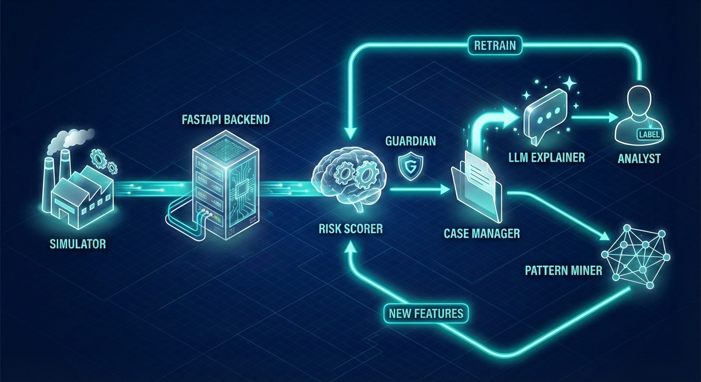

# Autonomous Fraud Detection Agent

**Drishpex 2026** | Self-improving ML + Graph Pattern Mining + LLM Reasoning

Fraud detection today is a one-way street — models score, analysts investigate, and nothing flows back. New attack patterns go undetected until someone manually intervenes. We built a fraud agent that completes the loop autonomously: it scores, flags, learns from analyst feedback, and discovers new fraud patterns from the transaction graph — no manual retraining, no rule writing, no waiting.

---

## Submission Links

| Resource | Link |
|----------|------|
| Live Demo | [http://44.215.67.132:8501](http://44.215.67.132:8501) |
| API Docs | [http://44.215.67.132:8000/docs](http://44.215.67.132:8000/docs) |
| GitHub Repo | [github.com/naqeebali-shamsi/deriv-ai-sprint-feb-2026](https://github.com/naqeebali-shamsi/deriv-ai-sprint-feb-2026) |
| Video Presentation | *TBD* |
| Slide Deck | [https://notebooklm.google.com/notebook/541e4c24-b36c-412e-8282-99e360e60f36?artifactId=0c81fb24-3b0b-44d5-8159-411f4f87f006](https://notebooklm.google.com/notebook/541e4c24-b36c-412e-8282-99e360e60f36?artifactId=0c81fb24-3b0b-44d5-8159-411f4f87f006) |

---

## The Problem

Derivatives platforms face fraud vectors that static rules cannot catch: wash trading rings, structuring below thresholds, velocity abuse, and multi-account bonus fraud. Traditional rule engines generate **90-95% false positive rates** — for every 100 alerts, only 5-10 are real fraud. Analysts drown in noise, real fraud slips through, and by the time a new rule is written, fraudsters have already moved on.

The financial industry detects only about **2% of global financial crime flows** (Interpol). Every $1 lost to fraud costs financial institutions **$5** in total impact — investigation, legal, recovery, and regulatory costs (LexisNexis 2025). The problem is accelerating: fraudsters automate faster than compliance teams can respond.

---

## The Solution

An autonomous fraud agent that closes the loop: transactions stream in continuously, every one is scored in <100ms by an ML model with 35 engineered features, high-risk transactions automatically become cases, an LLM investigates and explains each case, and when an analyst confirms a label, the model retrains itself in the background. Meanwhile, a graph miner discovers new fraud structures (wash trading rings, hub accounts, velocity clusters) and feeds those patterns back into the scorer — no human intervention required.

**The loop:** stream → score → flag → explain → label → retrain → discover patterns → score better.

---

## How It Works

The analyst does exactly three things. Everything else is the agent.

1. **Open the dashboard** — transactions are already streaming in and being scored. Cases are already appearing. The analyst didn't trigger any of this.
2. **Pick a case, click "AI Explain"** — the LLM reads the transaction graph, velocity signals, and pattern context, then produces an investigation report with a recommended action. A 20-minute manual investigation becomes a 5-second read.
3. **Label it** (fraud or legit) — that's the analyst's only real input. The moment they confirm, the system retrains the ML model in the background, and the next transaction is scored by a better model.

Meanwhile, with zero user involvement: the pattern miner runs on the transaction graph and surfaces new fraud structures (wash trading rings, hub accounts, velocity clusters). Those patterns become features that flow back into the scorer automatically.

**The human only touches "explain" and "label".**

---

## Architecture



**Pipeline:** Stream → Score (28 core features + 7 pattern-derived = 35 total) → Case → Label → Learn → Pattern Discovery

Two autonomous feedback loops drive continuous improvement:
- **Retrain loop** (top): Analyst labels → model retrains → Risk Scorer improves
- **Feature loop** (bottom): Pattern Miner discovers graph structures → new features flow into Risk Scorer

---

## Key Features

### Autonomous Behaviors
- **Real-time streaming scoring** — every transaction scored in <100ms, cases created automatically when risk exceeds thresholds
- **Auto-retrain** — model retrains itself from analyst labels in the background, no manual trigger needed
- **Scheduled pattern mining** — graph miner runs autonomously, discovers new fraud structures without instruction
- **Guardian agent** — LLM-powered model lifecycle agent that decides retrain/skip, evaluates new models, and rolls back if quality drops
- **Pattern-to-ML feedback loop** — 7 graph-derived features (`sender_in_ring`, `sender_is_hub`, `sender_in_velocity_cluster`, `sender_in_dense_cluster`, `receiver_in_ring`, `receiver_is_hub`, `pattern_count_sender`) flow from pattern mining back into the scorer at scoring time

### AI/ML Application
- **XGBoost scorer** — 35-feature XGBClassifier with L1/L2 regularization, stratified 5-fold cross-validation, class imbalance handling via `scale_pos_weight`
- **Graph algorithms** — Tarjan's SCC (ring detection), HITS (hub detection), sliding window two-pointer (velocity clusters)
- **Multi-agent LLM explanations** — 3 specialist analysts (Behavioral, Network/Pattern, Compliance) produce parallel analyses, synthesized by a 4th Lead Analyst into a single investigation report
- **Active learning** — surfaces the most uncertain cases (risk score closest to 0.5) for analyst labeling, maximizing information gain per label

### Originality
- **Full closed-loop autonomy** — not just scoring, but pattern discovery → feature engineering → retraining, all without human intervention
- **Derivatives-native fraud typologies** — wash trading, unauthorized transfers, bonus abuse, structuring, velocity abuse (not generic payments fraud)
- **Adversarial testing suite** — 5 evasion-strategy generators for red-team evaluation of model robustness
- **Hero golden path** — guaranteed 100% demo reliability for the critical demo flow

---

## Business Value

| Metric | Before (Rule-Based) | After (Autonomous Agent) |
|--------|---------------------|--------------------------|
| False positive rate | 90-95% | **4.3%** (precision 95.7%) |
| Detection latency | Hours to days | **<100ms** (real-time) |
| Investigation time | 20-30 min per case | **<5 min** (AI pre-investigation) |
| Model update cycle | Quarterly vendor updates | **Continuous** (after each label) |
| New pattern discovery | Manual rule writing | **Automatic** (graph mining) |
| Analyst team needed | 10 analysts (~$750K/yr) | 3-4 analysts (~$300K/yr) |

**Self-improvement demonstrated:** Model v0.1.0 (F1 = 0.57) → analyst labels applied → Model v0.2.0 (F1 = 0.967, Precision = 0.957). The system gets better every time an analyst confirms a label.

---

## By The Numbers

| Stat | Value | Source |
|------|-------|--------|
| ML Features | 35 (28 core + 7 graph-derived) | `risk/scorer.py` |
| Model Validation | 5-fold stratified CV, F1 = 0.97 +/- 0.04 | `models/metrics_v0.1.0.json` |
| Graph Algorithms | 4 (Tarjan SCC, HITS, sliding window, directed density) | `patterns/miner.py` |
| Autonomous Actions | 7 agent behaviors, zero human trigger | `backend/main.py`, `risk/guardian.py` |
| API Surface | 25 endpoints, 10 SSE event types, 9 DB indexes | `backend/main.py`, `backend/db.py` |

> Full breakdown with feature lists, algorithm details, and code references: **[docs/SYSTEM_STATS.md](docs/SYSTEM_STATS.md)**

---

## Tech Stack

| Component | Technology |
|-----------|-----------|
| Backend | FastAPI + uvicorn |
| UI | Streamlit + HTML5 Canvas |
| Database | SQLite (WAL mode) |
| ML Model | XGBClassifier (XGBoost) |
| Graph Mining | networkx |
| LLM | Ollama (llama3.1:8b) |
| Simulator | 5 fraud typologies (wash trading, unauthorized transfer, bonus abuse, structuring, velocity abuse) |
| Graph Algorithms | Tarjan's SCC, HITS, sliding window two-pointer |

---

## Quick Start

```bash
# Install dependencies
pip install -r requirements.txt

# Run the full demo (init DB + bootstrap model + backend + UI + simulator)
python scripts/demo.py
```

Then open:
- **UI:** http://localhost:8501
- **API Docs:** http://localhost:8000/docs
- **Health:** http://localhost:8000/health

### Docker

```bash
# Build and run
docker compose up --build

# With DB init, seed data, and LLM model pull
docker compose --profile setup up --build
```

Notes:
- `docker compose` includes an Ollama service (internal only, not publicly exposed) for LLM explanations.
- The `setup` profile initializes the DB, bootstraps the ML model, pulls the LLM, and seeds demo data.
- Copy `.env.example` to `.env` to customize settings (`BACKEND_PORT`, `DATABASE_PATH`, `OLLAMA_URL`, `FRAUD_RATE`, `LOG_LEVEL`).

---

## Project Structure

```
├── backend/     # FastAPI + DB layer
├── risk/        # ML scorer, trainer, LLM explainer
├── patterns/    # Graph mining + pattern cards
├── sim/         # Transaction simulator (5 fraud types)
├── ui/          # Streamlit dashboard
├── schemas/     # JSON Schema contracts
├── scripts/     # Demo runner, DB init, validation
├── tests/       # Schema + pipeline tests
├── models/      # Trained ML models (gitignored)
└── docs/        # Demo script, architecture, Q&A
```

---

## API Reference

| Method | Endpoint | Description |
|--------|----------|-------------|
| POST | `/transactions` | Ingest and score a transaction |
| GET | `/transactions` | List recent transactions |
| GET | `/transactions/{id}` | Get transaction detail |
| GET | `/cases` | List cases (filterable by status) |
| POST | `/cases/{id}/label` | Analyst labels a case |
| GET | `/cases/suggested` | Active learning — most uncertain cases |
| GET | `/cases/{id}/explain` | AI-powered case explanation |
| GET | `/cases/{id}/explain-stream` | Streaming explanation (SSE) |
| GET | `/metrics` | System metrics (precision/recall/F1) |
| GET | `/metric-snapshots` | Model performance history |
| POST | `/retrain` | Retrain model from analyst labels |
| POST | `/retrain-from-ground-truth` | Retrain from simulator ground truth |
| POST | `/mine-patterns` | Trigger pattern mining |
| GET | `/patterns` | List discovered patterns |
| GET | `/stream/events` | SSE event stream for real-time UI |
| GET | `/simulator/status` | Get simulator config and state |
| POST | `/simulator/start` | Start embedded simulator |
| POST | `/simulator/stop` | Stop simulator |
| POST | `/simulator/configure` | Configure fraud types and rate |
| GET | `/health` | Health check |
| GET | `/ready` | Readiness probe |

---

## Development

```bash
python scripts/bootstrap_model.py --force  # Required before scoring
pytest tests/ -q                           # Run tests
ruff check .                               # Lint
ruff format .                              # Format
python scripts/validate_schemas.py         # Validate schemas
```
